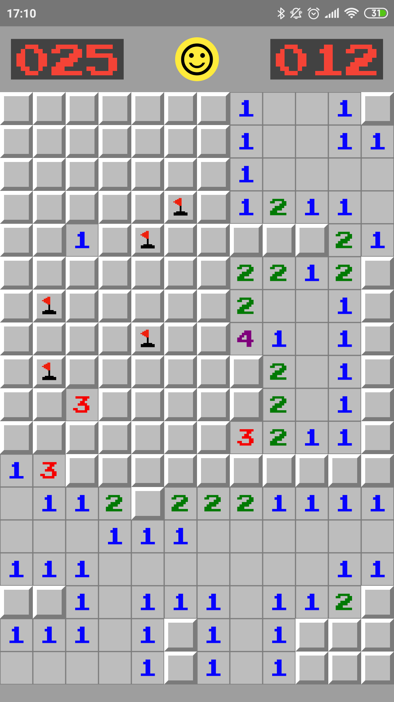
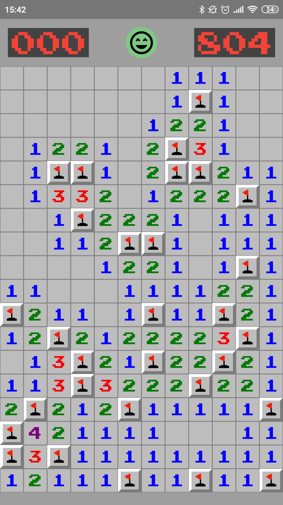
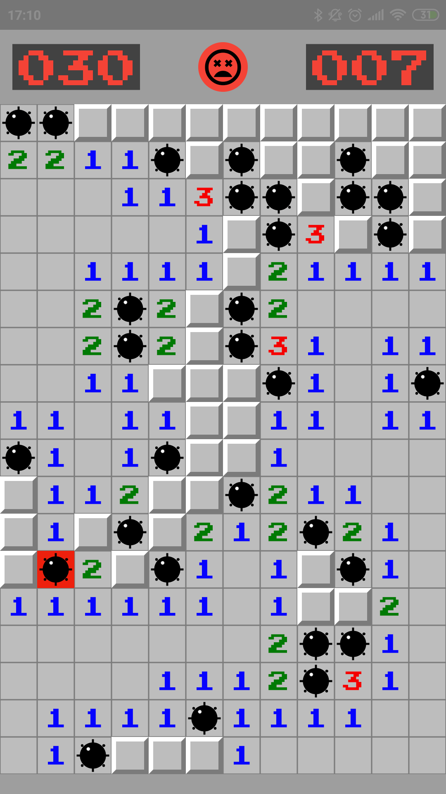

<h1 align="center">
  
  

    Minesweeper
  

</h1>

  
  
  

## Projeto

Minesweeper (Campo Minado): O objetivo do jogo é limpar um tabuleiro retangular contendo "minas" ou bombas ocultas sem detonar nenhuma delas, com ajuda de pistas sobre o número de minas vizinhas em cada campo.

## Features

Esse projeto foi desenvolvido com as seguintes tecnologias:

- [Flutter](https://flutter.dev/)
- [Dart](https://dart.dev/)

## Utilizando o projeto

1. Clone o repositório utilizando: `git clone git@github.com:yuriazevedo11/minesweeper.git`
2. Entre na pasta do repositório: `cd minesweeper`
3. Rode `flutter run` para o iniciar a aplicação no emulador ou em seu dispositivo

OBS: Caso tenha escolhido rodar pelo emulador Android, você terá que abri-lo antes de rodar o comando, no iOS ele abre sozinho.
